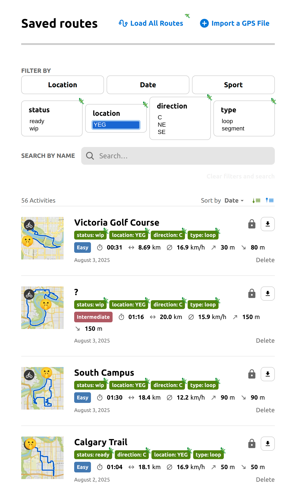
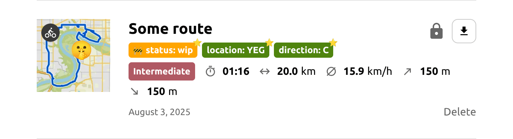
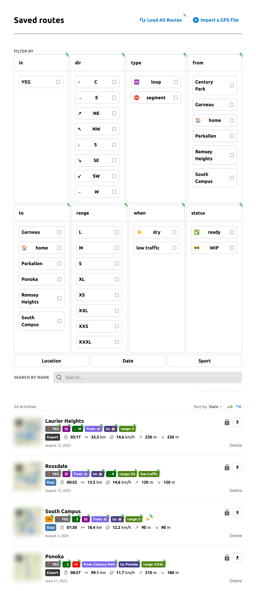

<!-- Project Header -->
<div align="center">
  

  <h1 class="projectName">Komodo - Mods for Komoot</h1>

  <p class="projectBadges info">
    
    
    
    <a href="LICENSE">
      
    </a>
    <a href="https://github.com/semantic-release/semantic-release">
      
    </a>
  </p>
  <p class="projectBadges status">
    
    <a href="https://github.com/jerboa88/enhancements-for-komoot/releases/latest">
      
    </a>
    <a href="https://greasyfork.org/en/scripts/545361-komodo-mods-for-komoot">
      
    </a>
    <a href="https://github.com/jerboa88/komodo/raw/refs/heads/main/dist/komodo.user.js">
      
    </a>
  </p>

  <p class="projectDesc">
    A userscript for Komoot.com that adds additional features for route planning.
  </p>

  <br/>
</div>

> [!WARNING]
> This is currently an experimental project or proof-of-concept. It may contain bugs or incomplete features, and is not intended for production use. Breaking changes may be made at any time. Consider more stable alternatives for critical applications.

## 👋 About

Using [Komoot](https://www.komoot.com/) for route planning? This script may help. It runs in your browser and adds additional features to the site to help you plan your next adventure.

### Features

- **🏷️ Custom tags**:
  - **Add**: Add custom tags like location, activity type, directionality, or difficulty to your routes
  - **Filter**: Filter your saved routes to find the perfect route by including or excluding certain tags
  - **Customize**: Advanced users can customize the appearance of tags and filter controls using CSS

### Screenshots

|  |
| ---------------------------------------------------------------------------------- |
| _Komoot's route list page with Komodo - v1.0.0_           |

## 📦 Installation
>
> [!CAUTION]
> For security reasons, I do not recommend running scripts from the internet unless you understand what they are doing. If you are not a developer, I recommend reading the comments in the code and/or asking a LLM like [ChatGPT](https://chatgpt.com/) or [Claude](https://claude.ai) to explain it to you.

I recommend using this script with a userscript manager because it will keep the script up-to-date and run it automatically when you visit the appropriate page. If you don't want to do that, you can also run it manually.

### Using a userscript manager

A userscript manager is a browser extension that allows you to organize and run scripts on websites. If you don't already have one, I would recommend [Violentmonkey](https://violentmonkey.github.io/), [Tampermonkey](https://www.tampermonkey.net/index.php), [ScriptCat](https://docs.scriptcat.org/), or [Greasemonkey](https://github.com/greasemonkey/greasemonkey). For more choices, see [this comparison table](https://github.com/awesome-scripts/awesome-userscripts?tab=readme-ov-file#compatibility).

You can then click the button below to install the latest version of the script directly from this repo:

[](https://github.com/jerboa88/komodo/raw/refs/heads/main/dist/komodo.user.js)

or install it from [GreasyFork](https://greasyfork.org/):

[](https://greasyfork.org/en/scripts/545361-komodo-mods-for-komoot)

Note that the latest version may include breaking changes from time to time. You can choose to install a specific version of the script instead on the [releases page](https://github.com/jerboa88/komodo/releases).

### Manually
>
> [!NOTE]
> This only works once. If the page gets reloaded or you navigate away and come back, you will have to run the script again. If you want to run the script automatically, I suggest using a userscript manager.

Alternatively, you can run the script by going to a supported page, copying the code in [dist/komodo.user.js](dist/komodo.user.js), and pasting it into your browser's devtools console. The following pages are supported:

- Route list page (ex. <https://www.komoot.com/user/YOUR_USER_ID/routes>)
- Route page (ex. <https://www.komoot.com/tour/YOUR_ROUTE_ID>)

<details>
  <summary><b>Detailed instructions:</b></summary>
  <ol>
    <li>Open <a href="https://www.komoot.com/user/YOUR_USER_ID/routes">komoot.com/user/YOUR_USER_ID/routes</a> or <a href="https://www.komoot.com/tour/YOUR_ROUTE_ID">komoot.com/tour/YOUR_ROUTE_ID</a> in your browser</li>
    <li>Open your browser's devtools console (<a href="https://balsamiq.com/support/faqs/browserconsole/">how?</a>)</li>
    <li>Copy the code in <a href="dist/komodo.user.js">dist/komodo.user.js</a> and paste it into the console. If this doesn't work or you see a warning message about pasting, see the <a href="#FAQ">FAQ</a>.</li>
    <li>Press enter to run the script. You should see the page update. If this doesn't happen, see the <a href="#FAQ">FAQ</a>.</li>
  </ol>
</details>

## 🕹️ Usage

All UI elements added to the Komoot website have a lizard icon (🦎) in the top right corner so they can be easily identified.

### Adding tags to routes

Tags can be added to a route by including a specially formatted label in the route name using the Komoot website or app as usual. There is currently no visual editor for tags.

Each tag must be in the format `[tagName:tagValue]` and adhere to the following formatting rules:

- Multiple tags can be added to a route, and they can be added anywhere in the route name (ex. `[status:WIP] My Route [direction:north]`)
  - Note that tags will be stripped from the route name, so if you add them inbetween words, the resulting title may have weird spacing
  - If you want cleaner route names on mobile, consider adding them at the end
- Tag names and values are case-sensitive (ex. `[status:WIP]` is different from `[status:wip]`)
- You can include whitespace around names and values—it will be stripped out when the tag is displayed (ex. `[a:b]`, `[a: b]`, and `[ a : b ]` are all equivalent)
- Spaces in the middle of tag names and values will be preserved, so you can have multi-word names and values (ex. `[Start Point:Home]`)
- The special characters `[`, `]`, and `:` are not allowed in tag names and values because they are used to delimit tags. Emojis, spaces, and all other characters are allowed (ex. `[🚗:💨]` is valid)

For example, setting a route name to `[status:WIP] My Route [Start_Point:Home] [direction:north]` will add the following tags to the route:


### Loading all routes

This script uses the tags found in the route list to populate the filter controls.

By default, Komoot only loads a handful of routes at a time, so if you notice that some tag names/values are missing from the filter controls, click the `Load All Routes` button to force load the entire list of routes. This may take a few seconds to complete.

### Filtering by tags

On the route list page, you can filter routes by tag. A group of checkboxes will be added to the `Filter by` section for each tag name.

By default, nothing will be filtered out of the list. Click a checkbox once to only show routes with that value. Click the checkbox a second time to **exclude** any routes with that value. You can click once more to reset the checkbox.

You can filter by multiple tag names/values at the same time. By include/exclude checking all checkboxes in a tag name group, you can effectively filter routes by the presence of that tag name. For example, exclude checking all checkboxes for the `status` tag name will show you routes that you haven't assigned a status.

It is also possible to search through tags using the search box, because the built-in Komoot search feature still uses the original route titles. This means keyword order is important while searching, and because keywords you enter may unexpectedly match tags, you may want to name them accordingly to avoid this. For example, you could search for `[status:` to get all routes with tag name `status`.

## 🤖 Advanced Usage

### Customizing the appearance of the UI

This script adds various classes, ids, data attributes, and CSS variables to the elements it creates or modifies. You can use these to further customize the appearance of the UI using custom CSS styles.

#### Targeting elements

In general, elements added to the page will have a class added that starts with `komodo-`. Data attributes like `data-komodo-tag-name` and `data-komodo-tag-value` are added to pill elements and filter controls which can be used to target specific elements. You can inspect these elements using your browser's developer tools or refer to the following files for more details on the attributes added:

- Classes and data attributes: [src/constants.ts](src/constants.ts)
- CSS variables: [src/style.css](src/style.css)

Tags pills have multiple children so that you can style the name, value, and separator separately. This is handy because you can use an easy to type tag name like `loc`, but use CSS to replace the original value with something more readable like `Location` or even an emoji like `📍`. You can even hide parts of the tag completely to save space if you wish.

#### Applying styles

To add custom CSS to pages, you can use a user style manager like [Stylus](https://github.com/openstyles/stylus).

For example, you could use the following CSS to change the background color and add an emoji to all pills with the name `status` and the value `wip`:

```css
.komodo-pill[data-komodo-tag-name='status'][data-komodo-tag-value='WIP'] {
  background: orange;

  & > div::before {
    content: '🚧 ';
    font-size: x-small;
  }
}
```

|  |
| ---------------------------------------------------------------------------------- |
| _Custom pills on the route list page - v0.1.0_           |

For a more complete example, see [examples/custom-styles-for-komodo.user.css]. These are similar to the styles I am actually using:

|  |
| ---------------------------------------------------------------------------------- |
| _Kitchen sink styles ([examples/custom-styles-for-komodo.user.css]) on the route list page - v1.0.0_           |

## ❓ FAQ

### Nothing shows up when I paste in the console / I get a warning when I try to paste in the console

Some browsers prevent you from pasting code in the console because it could be malicious. This is called Paste Protection and you can read more about it on the [Chrome for Developers Blog](https://developer.chrome.com/blog/self-xss).

If this happens, follow the instructions in the console to re-enable pasting, and then try again. For Chrome, the following steps should work:

 1. Try to paste something in the console. You should get a warning message about pasting
 2. Type "allow pasting" in the console and press enter

 See [this video](https://youtu.be/X5uyCtVD1-o?si=AOrzgez90KiDlA-z&t=11) for a visual walkthrough.

### I get an `Uncaught SyntaxError: Unexpected identifier` error when running the script

Make sure that you select the entire file with <kbd>Ctrl</kbd> + <kbd>A</kbd> when copying it. If part of the script is cut off, it won't work.

## 🤝 Contributing

If you encounter any problems with the script, feel free to [create an issue](https://github.com/jerboa88/komodo/issues).

Pull requests, bug reports, translations, and other kinds of contributions are greatly appreciated. By contributing code, you agree to license your contributions under the terms of the [LICENSE].

### Background

This project is written in [TypeScript](https://www.typescriptlang.org/) and uses [Vite](https://vite.dev/) and [vite-plugin-monkey](https://github.com/lisonge/vite-plugin-monkey) to bundle the code into a single file that can be installed as a userscript.

We use [Bun](https://bun.sh/) for package management. You can use another package manager if you want, but you'll have to replace refererences to `bun` or `bunx` in the following places:

- Script commands in `package.json`
- Husky hooks in `.husky/*`
- Workflows in `.github/workflows/*`

The [Conventional Commits](https://www.conventionalcommits.org/) specification is used for commit messages. These conventions are enforced using [Commitlint](https://commitlint.js.org/) via [Husky](https://typicode.github.io/husky/) pre-commit hooks.

[Commitizen](https://commitizen-tools.github.io/commitizen/) is set up as well, so you can use `bun commit` to commit changes using an interactive prompt instead of `git commit`.

[Biome](https://biomejs.dev/) is used for linting and formatting.

[Semantic Release](https://semantic-release.gitbook.io/semantic-release/) is used to automate the release process.

### Getting Started

To work on the project locally, first clone the repository and run `bun install` to install the dependencies.

To build the script, run `bun run build`. This will create a `dist` folder with the compiled script.

To run the script in development mode, run `bun run dev`. This will start a development server that will watch for changes and rebuild the script automatically.

## 🧾 License

This project is licensed under the MIT License. See [LICENSE] for details.

The project logo is from the [Fluent Emoji](https://github.com/microsoft/fluentui-emoji) collection, licensed under the [MIT License](https://github.com/microsoft/fluentui-emoji/blob/main/LICENSE).

This project is not affiliated with or endorsed by Komoot in any way.

## 🖇️ Related

- **[Better Segments for Strava](https://github.com/jerboa88/better-segments-for-strava)** - A userscript for Strava that adds additional stats and features to the starred segments page.

## 💕 Funding

Find this project useful? [Sponsoring me](https://johng.io/funding) will help me cover costs and **_commit_** more time to open-source.

If you can't donate but still want to contribute, don't worry. There are many other ways to help out, like:

- 📢 reporting (submitting feature requests & bug reports)
- 👨‍💻 coding (implementing features & fixing bugs)
- 📝 writing (documenting & translating)
- 💬 spreading the word
- ⭐ starring the project

I appreciate the support!

[examples/custom-styles-for-komodo.user.css]: examples/custom-styles-for-komodo.user.css
[LICENSE]: LICENSE
